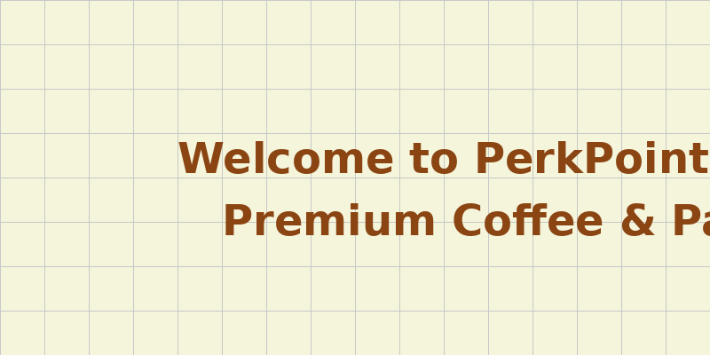

# PerkPoint

[](https://nodejs.org/)
[](https://www.postgresql.org/)
[](https://www.docker.com/)
[](https://www.jenkins.io/)
[](https://opensource.org/licenses/MIT)

A modern, full-stack coffee shop ordering platform built with Node.js, Express, PostgreSQL, and JWT authentication. Features a responsive frontend, admin panel, and complete CI/CD pipeline.

## Screenshots



## Features

- JWT Authentication - Secure user registration and login
- Role-Based Access - Customer and admin user roles
- Order Management - Place and track coffee orders
- Dynamic Menu - Admin-controlled menu items
- Payment Ready - Prepared for payment integration
- Responsive Design - Mobile-friendly interface
- Docker Support - Containerized deployment
- CI/CD Pipeline - Automated testing and deployment
- Admin Dashboard - Menu and order management

## Quick Start

### Prerequisites
- Node.js 18+
- PostgreSQL 15+
- Docker & Docker Compose (optional)

### Local Development

1. Clone the repository
   ```bash
   git clone https://github.com/jotyprokash/Jenkins-CI-CD-Pipeline-Setup.git
   cd Jenkins-CI-CD-Pipeline-Setup
   ```

2. Install dependencies
   ```bash
   npm install
   ```

3. Set up environment variables
   Create a `.env` file:
   ```env
   JWT_SECRET=your-secret-key
   DB_HOST=localhost
   DB_PORT=5432
   DB_NAME=perkpoint
   DB_USER=postgres
   DB_PASSWORD=password
   ```

4. Initialize database
   ```bash
   node init-db.js
   ```

5. Start the application
   ```bash
   npm start
   ```

6. Open your browser
   Navigate to `http://localhost:3000`

### Docker Development

```bash
docker-compose up --build
```

## API Endpoints

### Authentication
- `POST /api/auth/register` - User registration
- `POST /api/auth/login` - User login

### Menu
- `GET /api/menu` - Get all menu items
- `POST /api/admin/menu` - Add menu item (Admin)
- `PUT /api/admin/menu/:id` - Update menu item (Admin)
- `DELETE /api/admin/menu/:id` - Delete menu item (Admin)

### Orders
- `POST /api/orders` - Place new order
- `GET /api/orders` - Get user orders

### Other
- `POST /api/contact` - Contact form submission
- `POST /api/newsletter` - Newsletter subscription

## Deployment

### Docker Deployment
```bash
docker build -t perkpoint .
docker run -p 3000:3000 perkpoint
```

### Jenkins CI/CD
The included Jenkinsfile provides:
- Automated testing
- Docker image building
- Registry pushing
- Deployment triggers

## Contributing

We welcome contributions! Please see our [Contributing Guide](CONTRIBUTING.md) for details.

## Code of Conduct

Please read our [Code of Conduct](CODE_OF_CONDUCT.md) before contributing.

## License

This project is licensed under the MIT License - see the [LICENSE](LICENSE) file for details.
