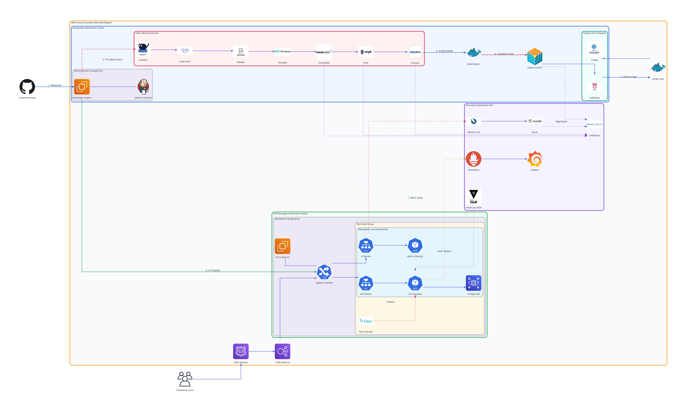

# 🎓 CourseHub: Production-Grade DevSecOps Platform

[](https://jenkins.io)
[](https://kubernetes.io)
[](https://helm.sh)
[](https://owasp.org)

CourseHub is a high-availability online learning platform built with a **Security-First** mindset. This project demonstrates a complete DevSecOps lifecycle, from automated "Shift-Left" security testing to elastic Kubernetes orchestration.

---

## 🏗️ Architectural Overview



### 🚀 Technical Stack
*   **Frontend**: Next.js (Optimized Standalone mode)
*   **Backend**: Node.js & Express
*   **Database**: PostgreSQL (StatefulSet for data persistence)
*   **Orchestration**: Kubernetes / k3s (EBS-backed storage, HPA scaling)
*   **Infrastructure Management**: Helm (Package manager)

---

## 🛡️ DevSecOps Pipeline (Jenkins)

The CI/CD pipeline implements a "Defense in Depth" strategy across 7 automated stages:

1.  **SAST (Semgrep)**: Automated static analysis to find code vulnerabilities.
2.  **Secrets Audit (Gitleaks)**: Scans the history to ensure no API keys or passwords are leaked.
3.  **Code Quality (SonarQube)**: Enforces coding standards and tracks technical debt.
4.  **SCA (Trivy)**: Scans Docker images for known CVEs in the OS and dependencies.
5.  **Helm Deployment**: Atomic, versioned deployments to Kubernetes.
6.  **DAST (OWASP ZAP)**: Automated penetration testing of the live staging environment.
7.  **Vulnerability Management**: Centralized reporting via DefectDojo.

---

## ☸️ Kubernetes Design Patterns

*   **StatefulSets**: Used for PostgreSQL to ensure stable network identity and zero-data-loss storage migration.
*   **HPA (Horizontal Pod Autoscaler)**: Automatically scales Backend and Frontend pods based on CPU load (Scales from 2 up to 10 replicas).
*   **Ingress Controller**: Managed via Nginx with ModSecurity WAF rules enabled.
*   **NetworkPolicies**: Implements Zero-Trust by isolating the database from the public internet.

---

## 🛠️ Local Development (Minikube)

To run this platform on your local machine:

### 1. Prerequisites
*   Docker & Minikube
*   Helm v3

### 2. Setup Minikube
```bash
minikube start --driver=docker
minikube addons enable ingress
```

### 3. Deploy the Platform
```bash
# Point to Minikube's Docker daemon
eval $(minikube docker-env)

# Build images locally
docker build -t jotyprokash/coursehub-backend:latest ./backend
docker build -t jotyprokash/coursehub-frontend:latest ./frontend

# Install via Helm
helm install coursehub ./helm/coursehub
```

### 4. Access the App
Update your `/etc/hosts`:
```bash
echo "$(minikube ip) coursehub.local api.coursehub.local" | sudo tee -a /etc/hosts
minikube tunnel
```
Visit: **[http://coursehub.local](http://coursehub.local)**

---

## 👨‍💻 Author
**Joty Prokash**  
*Senior DevSecOps Architect*
